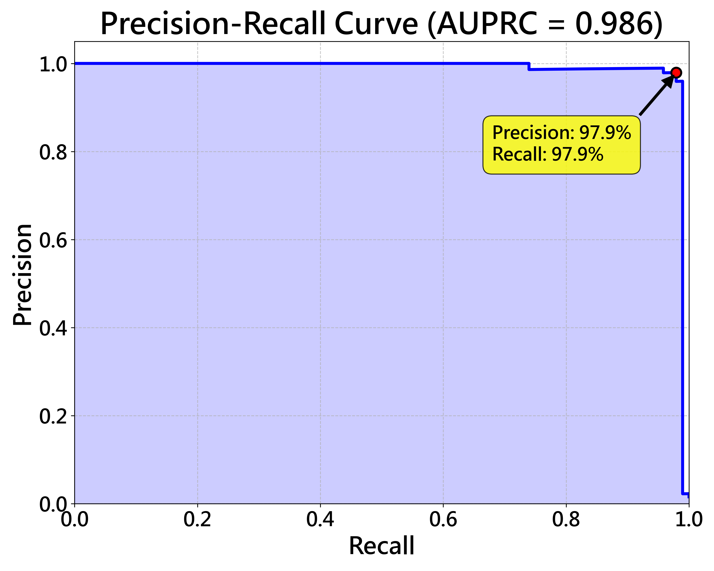

# A Low-Resolution Thermal Imaging-Based System for Skeleton Extraction and Fall Detection

本專案提出一套基於低解析度熱影像的跌倒偵測系統，透過 YOLOv8n-pose 進行骨架關鍵點抽取，再由 GRU 結合自注意力機制 分析時間序列動作。系統具備高敏感度、低誤報率，並能在 Raspberry Pi 5 等低功耗邊緣設備上即時運行，適合應用於智慧家庭、長照機構與醫療場域。

# 硬體設備
1. thermal camera hat捕捉熱像

2. 在樹梅派5上運行

# 資料前處理
## 1.熱像增強
```
python filtercupy.py
```
在處理完熱像後，標記遮罩的上下左右四個極值點連成bundingbox

## 2.可見光影像座標標記
```
python yolo box.py
python mediapipetest.py
```
取得完可見光影像的bundingbox、keypoint座標後
以熱像bundingbox作為依據，調整可見光座標為熱像label
```
python 調整box座標.py
```
## 3.熱像資料增強
```
python data_aug.py
```
取得最後熱像的label後
對image、label同時做以下資料增強

1. 縮放 (Scaling)

對圖片進行多種比例的縮放：[0.6, 0.8, 1.0, 1.2, 1.4]。

同時會調整關鍵點 (keypoints) 與邊界框 (bounding box) 的座標。

2. 旋轉 (Rotation)

對圖片進行旋轉，角度範圍是 -30° ~ +30°，以 15° 為間隔。

同樣會更新關鍵點與邊界框。

3. 水平翻轉 (Horizontal Flip)

做左右鏡像翻轉。

關鍵點的 X 座標會同步對應調整。

# 模型訓練

## 熱像骨架生成模型訓練
先凍結 Head 裡面的 cv4，使用少量的資料讓yolo能初步適應新的邊界框任務
```
python YOLOBOXTRAIN.py
```
整個網路一起使用大量資料訓練，以適應新的骨架生成任務
```
python TRAIN YOLO.py
```
## 跌倒偵測模型訓練

前處理:

1. 缺失值處理。

2. MinMax 標準化。

3. 滑動視窗 (Sliding Window) 序列化 (Time Steps = 10)。

不平衡處理 (DTW Interpolation):

1. 計算跌倒樣本之間的 DTW 距離。

2. 尋找最近鄰居 (Nearest Neighbors)。

3. 在對齊的時間路徑上進行線性插值生成新的跌倒序列。

```
python gru_train.py
```

# 訓練結果
## 1.gru


## 2.yolo


## 跌倒混淆矩陣


## AUPRC


## DEMO影片
https://drive.google.com/file/d/1F4gGI4SRWbgN1tfDQpohJoe9S3fSXMgZ/view?usp=drive_link
