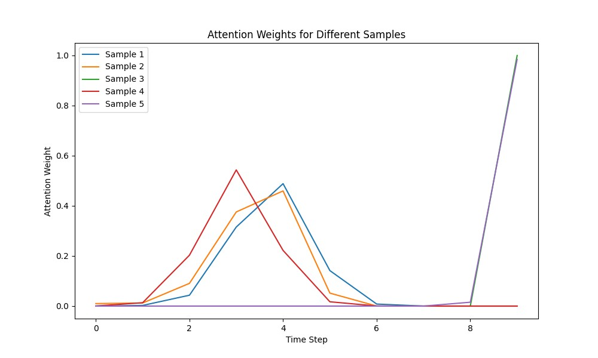
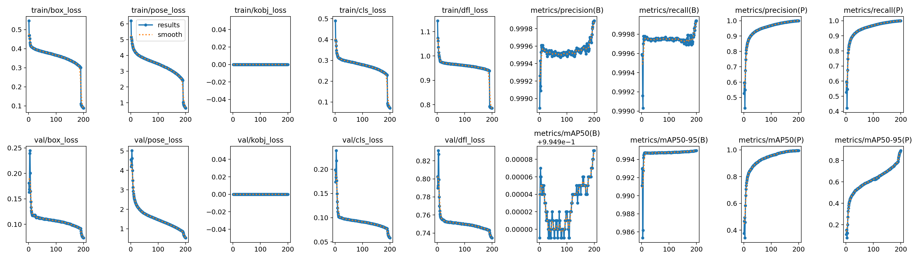
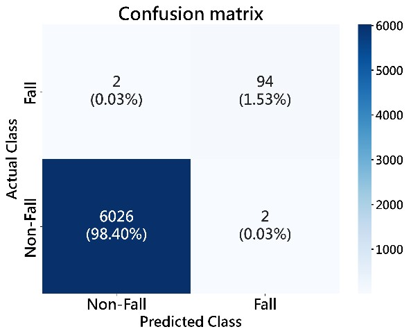
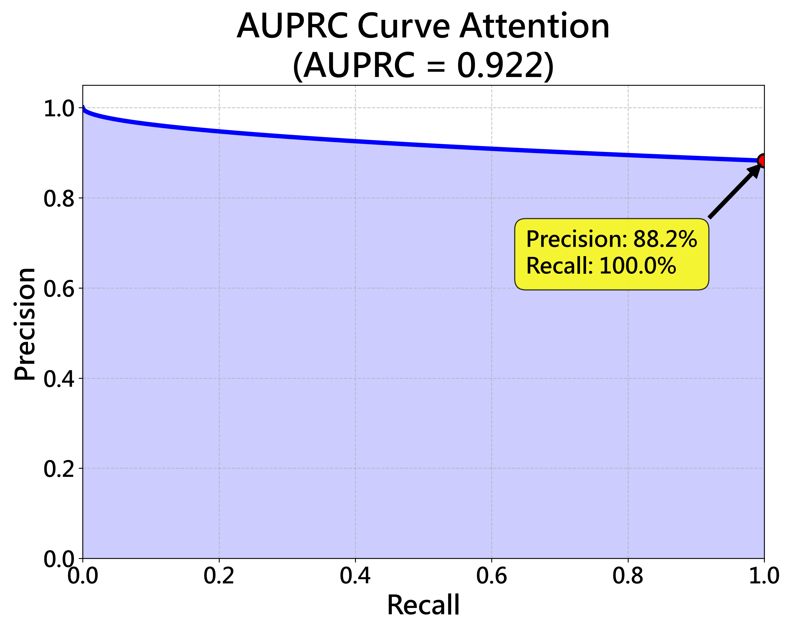

# A Low-Resolution Thermal Imaging-Based System for Skeleton Extraction and Fall Detection

This project proposes a fall detection system based on low-resolution thermal imaging. Key skeletal points are extracted using YOLOv8n-pose, and a GRU (Generic Randomization Logic Unit) combined with a self-attention mechanism analyzes time-series actions. The system features high sensitivity, low false alarm rate, and can run in real-time on low-power edge devices such as the Raspberry Pi 5, making it suitable for applications in smart homes, long-term care facilities, and medical settings.

# Hardware Equipment
1. Thermal Camera Hat: Used to capture thermal images.

2. Raspberry Pi 5: Used as the primary computing unit for system execution.

# Data Preprocessing
## 1.Thermal Image Enhancement
```
python filtercupy.py
```
After processing the thermal image, the bounding box is generated by connecting the four extreme points (top, bottom, left, right) of the masked area.

## 2.Visible Light Image Coordinate Labeling
```
python yolo_box_label.py
python mediapipe_skeleton_label.py
```
After obtaining the bounding boxes and keypoint coordinates from visible light images: The visible light coordinates are adjusted to serve as thermal image labels based on the thermal image bounding box alignment.
```
python adjust_label.py
```
## 3.Thermal Image Data Augmentation
```
python skeleton_data_aug.py
```
Once final thermal labels are obtained, both the images and labels undergo the following augmentations:

### Scaling

Images are scaled at multiple ratios: [0.6, 0.8, 1.0, 1.2, 1.4].

Keypoints and bounding box coordinates are adjusted accordingly.

### Rotation

Images are rotated within a range of -30° to +30° at 15° intervals.

Keypoints and bounding boxes are updated to match the rotation.

### Horizontal Flip

Mirroring the image horizontally.

X-coordinates of keypoints are adjusted symmetrically.

# Model Training

## Thermal Skeleton Generation Model Training
First, freeze the cv4 layer in the Head and use a small amount of data to allow YOLO to initially adapt to the new bounding box task.
```
python yolo_head_train.py
```
Then, train the entire network using the full dataset to adapt to the final skeleton extraction task.
```
python train_yolo.py
```
## Fall Detection Model Training

### Preprocessing:

1. Missing value handling.

2. MinMax Normalization.

3. Sliding Window serialization (Time Steps = 10).

### Imbalance Handling (DTW Interpolation):

1. Calculate DTW (Dynamic Time Warping) distances between fall samples.

2. Identify Nearest Neighbors.

3. Generate new fall sequences via linear interpolation along the aligned time path.

```
python gru_train.py
```

# Training Results
## 1.gru



## 2.yolo


## test_confusion_matrix


## AUPRC

.png)

# Final Execution on Raspberry Pi
```
python run_on_Raspberry_Pi_5.py
```

## Model Components

| File Name | Model Type | Function Description | Download Link |
| :--- | :--- | :--- | :--- |
| **`yolo_pose_model.pt`** | **YOLO Pose** | **Feature Extraction**: Detects human figures in thermal frames and identifies 17 key body joints (total 34 coordinate values). | [Download](https://drive.google.com/file/d/1Olg-yHHi5hESr3do-3YhIDSk9EPAcAsA/view?usp=drive_link) |
| **`keypoint_scaler.pth`** | **MinMaxScaler** | **Data Normalization**: Scales raw coordinates to a standard range (e.g., -1 to 1) to ensure consistent input for the GRU model. | [Download](https://drive.google.com/file/d/1jzFr45oXH1JrT94R0xWFa70LkDYn-o6T/view?usp=drive_link) |
| **`fall_detection_gru.pth`** | **GRU + Attention** | **Action Recognition**: Analyzes the temporal trajectory of the last 10 frames using an attention mechanism to classify "fall" patterns. | [Download](https://drive.google.com/file/d/10WCJETceW5ou51IuO6J0r_-KY1MxtWs_/view?usp=drive_link) |

## Data

| Data | Download Link |
| :--- | :--- |
| **`yolo_thermal_skeleton_training_data.zip`** | [Download](https://drive.google.com/file/d/1peC_V7-94WXNidvGdvbxPRQ3Me3lyJz8/view?usp=drive_link) |
| **`gru_fallen_keypoint_data.zip`** | [Download](https://drive.google.com/file/d/1JzPi80DqgPxZ71H5jt1C_MuYqAPBh16q/view?usp=drive_link) |

## DEMO
https://drive.google.com/file/d/1F4gGI4SRWbgN1tfDQpohJoe9S3fSXMgZ/view?usp=drive_link