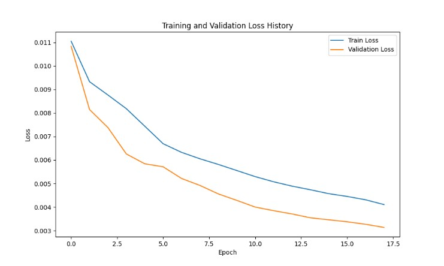
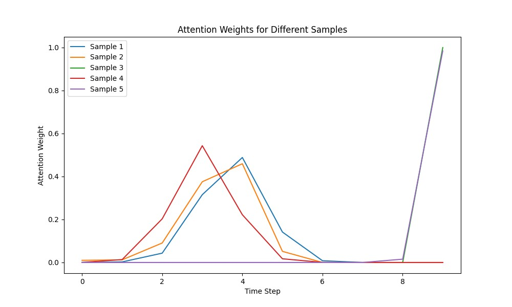
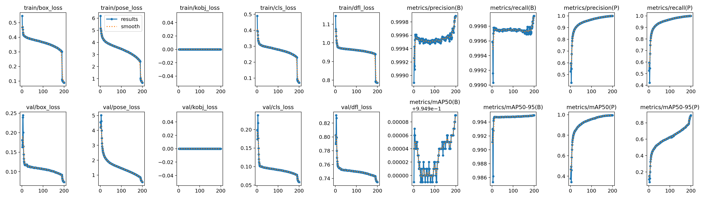
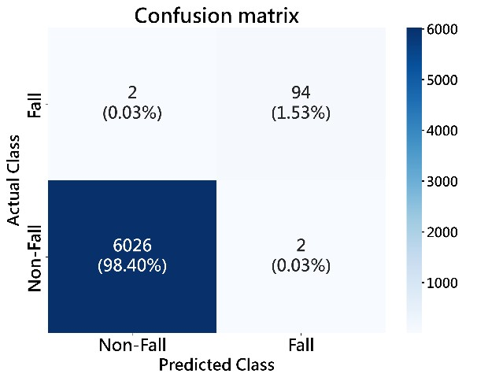

# Fall-detection-system-based-on-thermal-imaging-technology

# 硬體設備
1.thermal camera hat捕捉熱像

2.在樹梅派5上運行

# 資料前處理
## 1.熱像增強
```
python filtercupy.py
```
在處理完熱像後，標記遮罩的上下左右四個極值點連成bundingbox

## 2.可見光影像座標標記
```
python yolo box.py
python mediapipetest.py
```
取得完可見光影像的bundingbox、keypoint座標後
以熱像bundingbox作為依據，調整可見光座標為熱像label
```
python 調整box座標.py
```

# 模型訓練
```
python TRAIN YOLO.py
python gru_train.py
```

# 訓練結果
## gru



## yolo


## 跌倒混淆矩陣


## DEMO影片
https://drive.google.com/file/d/1F4gGI4SRWbgN1tfDQpohJoe9S3fSXMgZ/view?usp=drive_link
